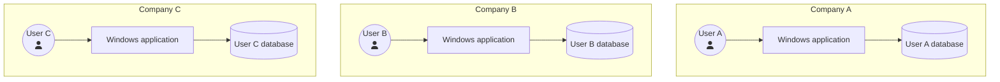
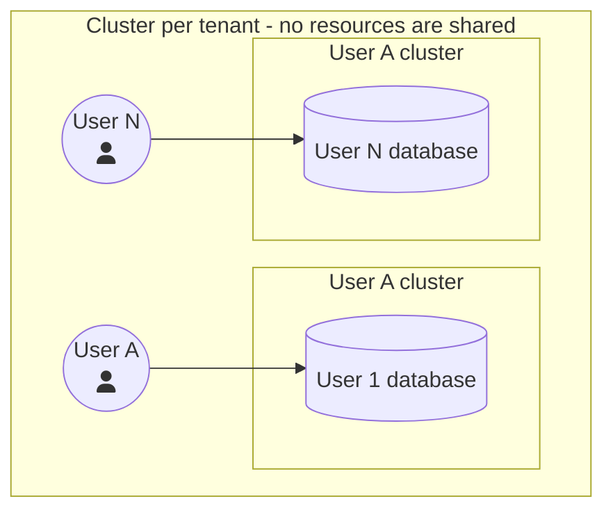
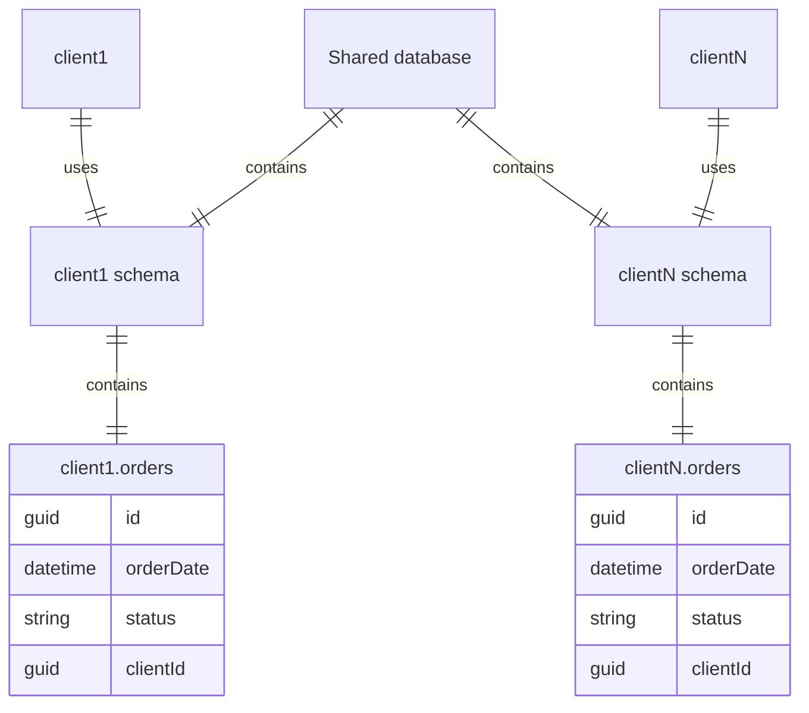
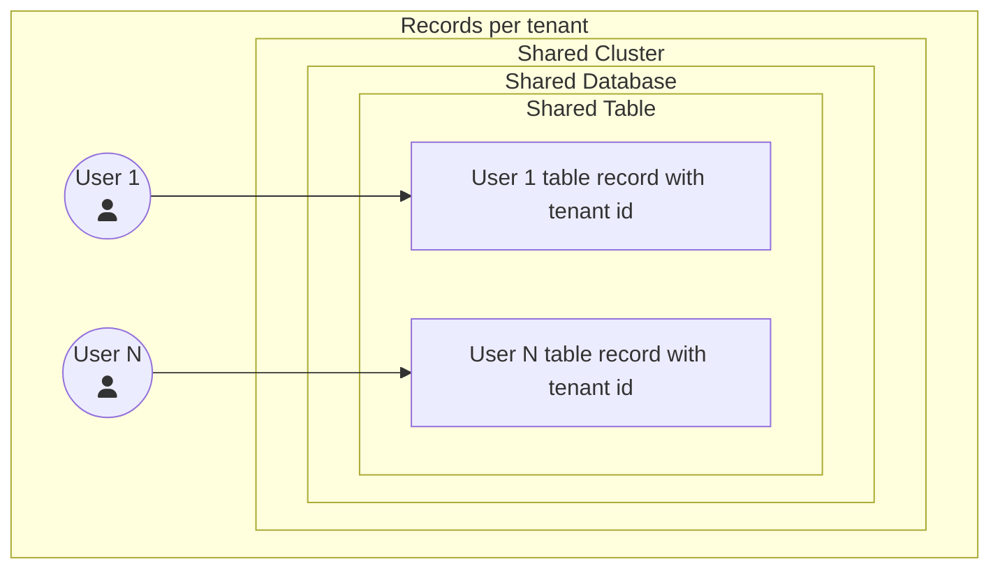
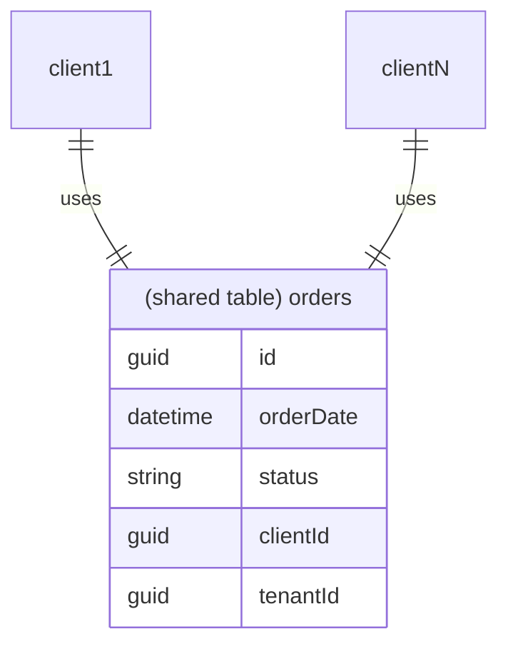
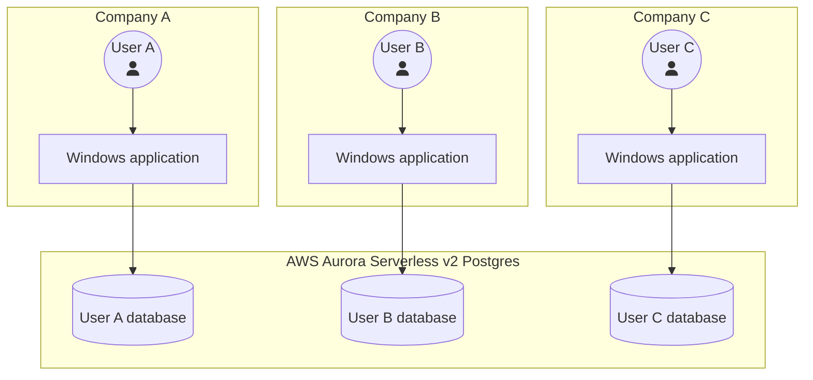
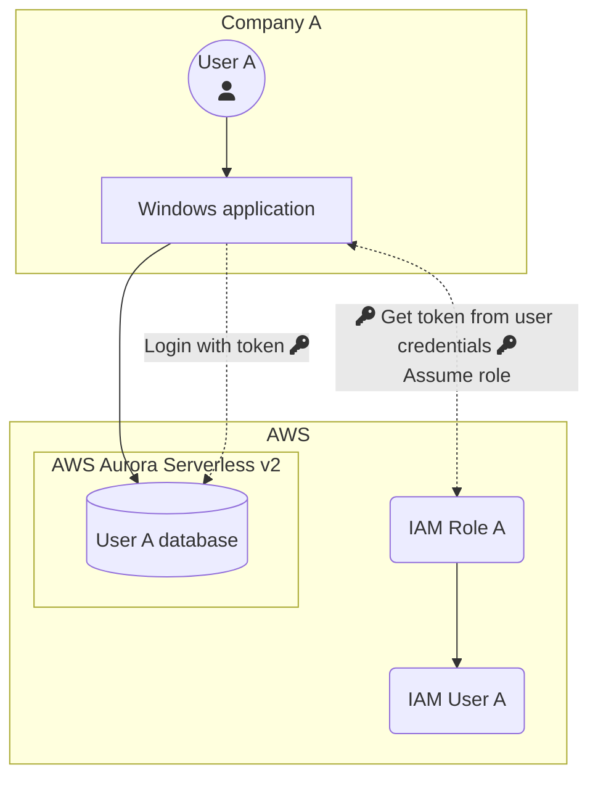
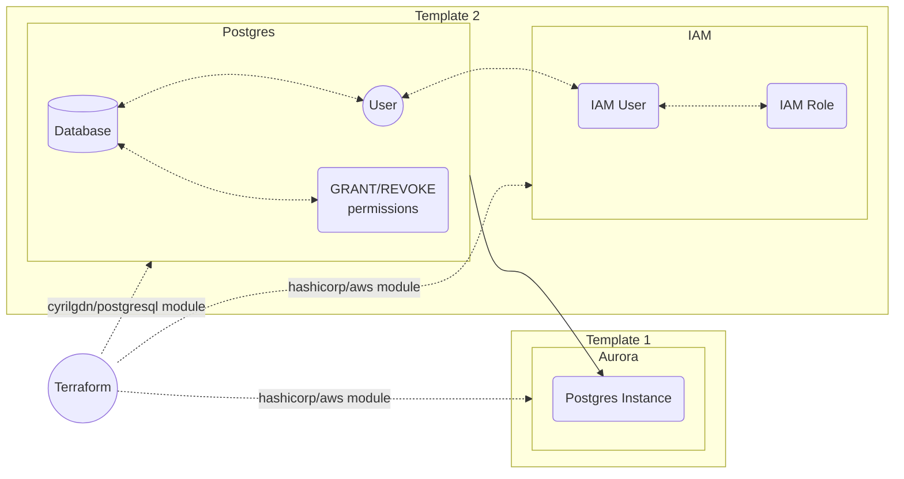

# Introduction
In this article, I will guide you through the process of building a cost-effective, scalable multitenant Postgres cluster. It is not as simple as it sounds! 
Recently, I was tasked with a similar project and quickly realized that there are many factors to consider when designing a multi-tenant data solution based on postgres. I want to share my journey of designing a solution that will be easy to use, cost-effective, secure, and scalable. 

# The Challange
> Our current approach was to install a PostgreSQL engine locally for each client, which was easy and cost-effective from our perspective. However, some clients were not satisfied with hosting additional software and hardware in their locations. They wanted the option of using a vendor-hosted and managed instance instead. To meet their needs, we had to ensure that the desktop app running on Windows could connect to both local and cloud databases with minimal changes to the code.



*Current architecture - single tenant per local cluster*


So desktop app running on windows is connecting to local instance of postgres like on diagram above. We wanted to make least changes to application code as possible and keep support for both local and cloud database so clients could choose if they want to keep it locally or pay few bucks per month and use instance managed by application vendor. In terms of multi-tenant database we have multiple options to achieve separation between tenants. 

# Options for Postgres multitenancy

When it comes to hosting data stores for multiple clients, there are several approaches to choose from, each with its own set of pros and cons. In this article, we'll explore four popular options for Postgres multitenancy.

## Cluster per tenant


With the cluster per tenant approach, each client has its own instance of Postgres, meaning that the only thing you need to worry about in terms of security is server patching and hardening. However, if you have more than a few instances, managing this type of setup can become quite complex and time-consuming, requiring a deep understanding of infrastructure-as-code (IaaC) automation tools like Ansible and Terraform.

This approach is widely used in hosting services and local deployments where clients need to manage their own instances. It's also a common option in premium/enterprise plans of software-as-a-service (SaaS) solutionts that offer exclusive resources and customization options. However, it's the most expensive option, and in most cases, there will be a huge amount of underutilized resources.

## Database per tenant
```mermaid!
flowchart TD;
    subgraph Database per tenant - shared cluster, multiple databases;
        U3((User 1<br>fa:fa-user))  --> Db3;
        U4((User N<br>fa:fa-user))  --> Db4;
        subgraph Cl3[Shared Cluster]
            Db3[(User 1 database)]
            Db4[(User N database)]
        end
    end;
```

With the database per tenant approach, each client has its own database within a shared cluster. This helps to better utilize resources and minimize administration efforts on the cluster level but increases security concerns. In the case of permission misconfiguration, a client could potentially access a database owned by another client.

This setup is common in both desktop apps and web applications where clients don't have direct access to the database, but application manages multiple connections string and decide which one to use for request. In many cases, it's possible to move from a cluster per tenant to a database per tenant with no code changes, making it a good option for those who have multiple clusters but are looking to simplify their infrastructure.

## Schema per tenant
```mermaid!
flowchart TD;
    subgraph Schema per tenant - shared cluster, shared database, multiple schemas;
        U5((User 1<br>fa:fa-user))  --> sc1;
        U6((User N<br>fa:fa-user))  --> sc2;
        subgraph Cl4[Shared Cluster]
            subgraph Db5[Shared Database]
                sc1([User 1 Schema])
                sc2([User N Schema])
            end
        end
    end;
```

In the schema per tenant approach, all clients use the same database. Permissions are set up on the schema level, so each client has its own schema within the shared database. This approach is widely used in modern web applications, and it is worth to mention that there is no schema limit per database.

Tables are duplicated for each user schema, as shown in the ER diagram below. The pros and cons of this approach are similar to those of the database per tenant approach, with the added benefit or drawback of not having to set up some configuration options that can only be set up on the database level.



## Records per tenant


In the records per tenant approach, everything is shared except for the database entries, which must be tagged with a value that allows the application to resolve the tenant. This is the cheapest approach in terms of maintenance, but it comes with a significant development and security overhead. A minor mistake can lead to displaying data from another tenant.

This approach is common in modern web applications where the application manages all aspects of access to data. As shown in the flowchart below, each client accesses a shared table, but only the records associated with that client's tenant ID are displayed.



# Options for PostgreSQL Databases in AWS Cloud
In AWS, we had a few options for PostgreSQL databases, including Amazon RDS for PostgreSQL, Postgres installed on EC2, and Amazon Aurora PostgreSQL. Installing Postgres on EC2 would have been an overkill in terms of additional efforts needed to configure and mantain postgres on EC2 instances, also scaling down to reduce cost is not straight-forward task, and we decided that we cannot use single database with schema per client or tables per client. It would be good choice for greenfield web application with multitenancy, but in this case we want to provide only required changes to the codebase. So in this scenario the only option is to use database or server per client.

We needed a cost-effective solution that wouldn't require us to commit to specific resources. We found that Amazon RDS for PostgreSQL reserved instances were cheaper, but we couldn't commit to resources since we weren't sure how much our clients would need. Therefore, we opted for Amazon Aurora PostgreSQL Serverless v1 or v2. Both offered what we needed, but we had to determine the differences between the two.

## Amazon RDS for PostgreSQL

RDS is optimal solution for most of workloads but because of unknown utilisation it cannot be used in this scenario.

| Pros | Cons |
| --- | --- |
| Easy to use | No easy way to scale up and down to reduce costs |
| Cost-effective with reserved instances | Instance size must be chosen when creating the database instance |
| | High costs without reservations |

## Amazon Aurora Serverless v1
Aurora Serverless v1 offers similiar capabilities to v2, but the key difference is how it scales up and down.

| Pros                       | Cons                                                              |
| ---------------------------|-------------------------------------------------------------------|
| Built-in scaling           | Scaling is slow. Scale down requires cooldown time                |
| Additional tools for backup and monitoring | Scaling is in x2 increments                       |
|                            | Additional code changes needed                                    |
|                            | No support for older Postgres versions                            |
|                            | No option for reservation in Serverless offering                  |
|                            | High price compared to reserved RDS instance with upfront payment |

With Aurora Serverless v1, scaling up can be slow, especially if the scaling happens during peak hours. Additionally, if the workload requires more capacity than the x2 increment, there can be a lot of unused capacity, leading to higher costs. Scaling down requires cooldown time and when it does need to perform a scaling operation, Aurora Serverless v1 first tries to identify a scaling point, a moment when no queries are being processed. By default, if autoscaling doesn't find a scaling point before timing out, Aurora Serverless v1 keeps the cluster at the current capacity which can be changed via `Force the capacity change` option.

## Amazon Aurora Serverless v2 :trophy:

| Pros | Cons |
| --- | --- |
| Pay only for what you use | Additional code changes needed |
| Automatic scaling up and down without downtime | No support for older Postgres versions |
| Terraform and CloudFormation support | No option for reservation in Serverless offering |
| IAM Roles support which enables limiting access to whitelisted IPs | High price compared to reserved RDS instance with upfront payment |
| Built-in additional tools for backup and monitoring | |
| Scaling from 0.5 to 128 ACUs with 0.5 increments | |
| Continuous backup feature | |

The most important difference between Aurora Serverless v1 and v2 is the way how both versions are scaling up and down. Aurora Serverless v1 scales up and down by x2 increments, while Aurora Serverless v2 scales up and down in 0.5 ACU increments. ACU is Aurora Capacity Unit and each ACU is a combination of approximately 2 gigabytes of memory, 2 vCPUs with hyperthreading, and network bandwidth. This difference in scaling increments has a significant impact on the efficiency of the system.

In contrast to v1, Aurora Serverless v2 scales up and down in much smaller increments, which makes it more flexible and cost-effective. The ability to scale in increments of 0.5 ACU allows for much more granular control over the resources allocated to the database. This means that capacity can be increased or decreased quickly, without incurring downtime, and with minimal unused capacity.

The minimal amount is 0.5 so it is not true serverless. 0.5 ACU * 730 hours in month will generate bill for about 50 $ but its still acceptable in our scenario, but for many projects, particularly true serverless 50usd for idling database could be crucial factor to use another service.

# Solution

There were few minor changes required in application codebase in order to connect to Aurora Cluster, like add SSL/TLS database connection support in application, and logic for IAM token generation, but we agreed that Aurora Serverless v2 is best fit for our needs, and those changes can be easily implemented. We selected [Database per tenant](#database-per-tenant) approach.


*Target architecture - multitenant cluster in AWS cloud*

In this blog post, I'd like to shift our focus towards the architecture of the solution, rather than the setup of the cluster. While there is an excellent video on YouTube channel "Be a Better Dev" (which you can watch at https://www.youtube.com/watch?v=kGTAcj_zI3o) that covers how to set up and connect to a cluster with IAM Users, I have gone a step further by implementing IAM Roles. This addition allows for IP whitelisting during login, which is a nice security feature.

## Pricing 💸
Cost estimation for about 50 users (15 clients) working on shared Aurora cluster.

| Usage          | Time                                         | ACU  | Cost  |
|----------------|----------------------------------------------|------|-------|
| No/very low    | Mon-Fri 15:00-7:00 + weekends (576 hours)    | 0.5  | 40.5$ |
| Moderate       | Mon-Fri 9:00-14:00 (105 hours)               | 5    | 44$   |
| High           | Mon-Fri 7:00-9:00 and 14:00-15:00 (63 hours) | 10   | 88$   |

> Other Services like data transfer, storage, Aurora backup: ~15$ per month

All of above is about 187.5 dollars per month. If we split the bill among 15 clients it gives us 12.5usd per client which is below initial expectations. Monthly spending will rise with every client added but dollar to client ratio should decrease with each new onboarded company.

When using Aurora Serverless v2, cluster per client would be expensive so the only option to cut the costs is to create single cluster with multiple databases which lead to security concerns.

## Autoscaling 

Amazon Aurora Serverless v2 is a powerful and easy-to-use managed database service that automatically scales up or down based on your application's needs. With Aurora Serverless v2, you can focus on developing your application without worrying about database management tasks such as scaling, backups, and patching.

Aurora Serverless v2's autoscaling capability is a standout feature that allows you to set minimum and maximum limits for your database cluster. This ensures that you only pay for the resources you need, and that your application can handle traffic spikes without any downtime.

When setting minimum limits, it is recommended to aim for the average minimum load of your application. If the load varies significantly between workdays and weekends, it's best to automate the process of adjusting the minimum value instead of setting it to the minimum observed load. This ensures that your database cluster can handle peak loads without any performance issues. It's worth noting that the larger the instance, the faster it will scale, so it's crucial to choose an appropriate minimum size that can handle peak loads without delays. For example, scaling from 4 ACU to 6 ACU will take more time than scaling from 10 ACU to 12 ACU.

When it comes to setting maximum limits, it's essential to monitor your application and database metrics to determine the appropriate size. Aim for the maximum average load, which ensures that your database cluster can handle traffic spikes without causing timeouts in your application. If there are occasional 100% usage peaks, don't worry as long as they don't cause any performance issues.

In summary, Amazon Aurora Serverless v2 is an effective and cost-efficient way to manage your relational database workload. Its autoscaling capability ensures that your database cluster can handle traffic spikes without any downtime, while appropriate minimum and maximum limits help your application handle any workload without performance issues.

After few load tests I configured instance to scale from 0.5 ACU which is minimum value to 5 ACU, which was enough to handle incoming traffic from first onboarded clients, but can be easily changed via Terraform for by changing `serverlessv2_scaling_configuration` in `aws_rds_cluster` resource and applying changes.

```terraform
resource "aws_rds_cluster" "this" {
  serverlessv2_scaling_configuration {
    min_capacity = 0.5
    max_capacity = 5.0
  }
}
```

After change:

```terraform
resource "aws_rds_cluster" "this" {
  serverlessv2_scaling_configuration {
    min_capacity = 1
    max_capacity = 8.0
  }
}
```

## Setting up AWS users and roles for access
To ensure the security of the solution, I leveraged both Postgres and AWS capabilities. AWS IAM Accounts and Roles are responsible for authenticating the user and checking if the login is coming from a whitelisted IP address. Unlike self-hosted solutions where we can manage the IP whitelist in `pg_hba.conf`, we don't have access to this file in Aurora instances. Therefore, I implemented the following steps in AWS **for each** onboarded client:
1. Create an IAM user
2. Created IAM Policy
```json
{
    "Version": "2012-10-17",
    "Statement": [
        {
            "Action": [
                "rds-db:connect"
            ],
            "Effect": "Allow",
            "Resource": "arn:aws:rds-db:eu-central-1:704209843502:dbuser:cluster-NOL3X6GTXDYEGEITNHBOTQV4CY/clientName"
        }
    ]
}
```
3. Created a role for the user with `allowed_ips` defined in a trust relationship and mapped policy from step 1.
```json
{
    "Version": "2012-10-17",
    "Statement": [
        {
            "Effect": "Allow",
            "Principal": {
                "AWS": "arn:aws:iam::704209843502:user/clientName"
            },
            "Action": "sts:AssumeRole",
            "Condition": {
                "IpAddress": {
                    "aws:SourceIp": "119.241.200.108/32"
                }
            }
        }
    ]
}
```
4. Created role mapping for the client with role created in step 2.
```json
{
    "Version": "2012-10-17",
    "Statement": [
        {
            "Action": [
                "sts:AssumeRole"
            ],
            "Effect": "Allow",
            "Resource": [
                "arn:aws:iam::704209843502:role/rds_cluster_clientName"
            ]
        }
    ]
}
```
5. Created access keys for the created account

## Setting up PostgreSQL
Each IAM account has a corresponding Postgres account, and permissions are assigned on Postgres for that account. To make the databases accessible to a specific client, I executed the following steps on Postgres:

1. Created a user with a random password because IAM credentials will be used
2. Created databases for the user
3. Revoked `PUBLIC` permissions on the created databases
4. Granted proper roles for the created account on the created databases
5. Enabled `rds_iam` role for the account

## IAM Authentication to database

In this setup, the user authenticates using AWS IAM credentials, and a token is generated that's used for accessing Postgres. This approach ensures that the user's identity is verified, and access is limited to only the whitelisted IP addresses.


*Connecting to database with AWS IAM Assume Role*

# Managing solution with Terraform

In the previous section, we discussed the complexity of the project and the potential for mistakes. To minimize the risk, we used Terraform to manage the entire project, which will be described in more detail in part 2 of this article. In this section, we'll provide a brief overview of how Terraform works and the modules we used.

Terraform is an Infrastructure as Code (IaaC) tool that we utilized to manage the setup of our project. To set up IAM and Aurora instances, we used the hashicorp/aws module, and to manage Postgres databases, we used the cyrilgdn/postgresql module. We used two separate templates to manage different aspects of the project.

The first template is responsible for setting up Aurora with the proper networking, backup, and maintenance settings. This template rarely requires changes, and we added additional parameters to prevent unwanted destroy actions:

```terraform
deletion_protection = true
```
```terraform
lifecycle {
    prevent_destroy = true
}
```
The second template is responsible for managing clients and does not touch the cluster. Instead, it manipulates IAM Users and Roles using the same module as for cluster creation and Postgres databases using the cyrilgdn/postgresql module.


*Terraform flow with modules*

Onboarding new clients is a straightforward process that involves updating the Terraform parameters file. This file allows us to select the client's name, choose which databases to create, limit allowed IPs to specific CIDRs, and disable IAM auth to use only the Postgres login. Here's an example of the Terraform parameters file:

```json
clients = [
    {
        name = "client01"
        databases = {
            db1 = true
            db2 = true
            db3 = false
        }
        allowed_ips = [
            "109.241.200.168/32"
        ]
        rds_iam_auth = true
    },
    {
        name = "client02"
        databases = {
            db1 = true
            db2 = false
            db3 = false
        }
        allowed_ips = [
            "0.0.0.0/0"
        ]
        rds_iam_auth = false
    }
]
```

Using Terraform to manage the setup of Postgres for each client simplifies the process and minimizes the potential for misconfiguration. This is especially important in the context of a shared cluster, where misconfigurations can have far-reaching consequences. Additionally, manually configuring the cluster is time-consuming, so Infrastructure as Code (IaaC) should be used whenever possible to improve efficiency and security.

# Conclusion

Building a scalable and cost-effective multi-tenant Postgres cluster on AWS Aurora Serverless v2 is possible by considering various factors such as scalability, cost, security, and ease of use. While several options are available, including Amazon RDS for PostgreSQL and Amazon Aurora Serverless v1, the most optimal solution for this scenario is Aurora Serverless v2. It provides automatic scaling without downtime, Terraform and CloudFormation support, built-in backup and monitoring tools, and IAM roles support for limiting access to whitelisted IPs. Moreover, Aurora Serverless v2 scales up and down in 0.5 ACU increments, which makes it more efficient than Aurora Serverless v1. By following the guidelines discussed in this post, you can successfully design a multi-tenant data store solution that is easy to use, secure, cost-effective, and scalable.