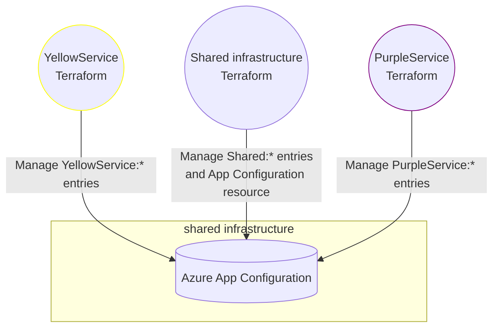
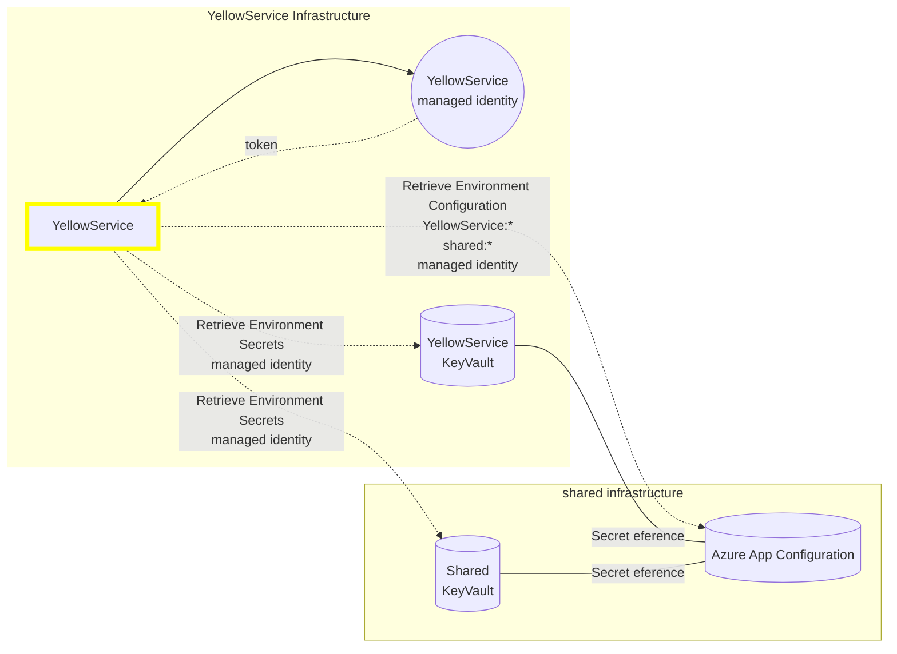

# Introduction

In one of my recent projects, we transitioned from App Services to AKS, incorporating tools like Helm and Helmfile into the mix. Managing the configurations proved to be a somewhat challenging task. Generic configurations, consistent across all environments, were stored in the `appsettings.json` file. Dynamic configurations, such as endpoints for connecting to services, were maintained in Terraform. Static, environment-specific configurations were handled via Helmfile. Additionally, the local development experience was less than ideal. Anytime an entry was added to the Terraform or Helmfile configurations, it had to be mirrored in the `appsettings.local.json` file. This led to developers struggling to manage and verify these configurations independently. Thus, the need for an easier configuration management solution became apparent. After exploring several options, I found that Azure App Configuration was the optimal solution for an application hosted on Azure, despite its limitations.

# Understanding Azure App Configuration

Azure App Configuration is a service that can be set up within minutes. It offers a centralized platform for storing key/value pairs and managing feature flags. This helps to separate configuration from application code, enabling changes without the need for redeployment or service restart. Beyond this, Azure App Configuration offers numerous beneficial features such as configuration history, snapshots, point-in-time restore for configuration backups, key vault references, geo-replication, and a provided API and SDK for popular programming languages. It offers both a standard and a free plan, making it ideal for proof-of-concept testing or scenarios with low usage. The standard version costs $1.20 per day.[^1] By default, it uses availability zones free of charge, so in most cases, a single instance without geo-replication suffices.[^2].

## When do I need it?

While there is no one-size-fits-all answer, Azure App Configuration may be beneficial if you're seeking to:
- dynamically modify your configurations,
- centralize and enhance visibility of application configurations,
- easily share configurations across multiple services,
- enhance the local development experience and reduce onboarding time,
- securely store all configurations and secrets via passwordless authentication,
- monitor and respond to events based on configuration changes.

In my case there was a need to enhance developer experience and simplify configuration management across service, but shortly after switching services to consume app configuration data, I started taking advantage of new service, and automated sendgrid configuration which in our scenario was time consuming manual error-prone task. The developer experience improved by a lot! After implementing app configuration, the only configuration needed on developer machine was to log-in to microsoft account within the IDE and provide approriate envrionment name and app configuration endpoint url.

In my situation, there was a requirement to improve the developer experience and simplify configuration management across services. However, shortly after transitioning services to consume app configuration data, I began to leverage the new service capabilities and automated SendGrid configuration, which in our context was a time-intensive, error-prone manual task. The improvement in the developer experience was substantial! After incorporating app configuration, the only configuration required on the developer's machine was to log into their Microsoft account within the IDE and provide the appropriate environment name and app configuration endpoint URL.

# Features 

At first glance, the service may seem overpriced for a simple key-value store, but it offers a rich set of additional features that justify its price.

## Feature flags
Feature flags are a powerful feature of App Configuration and may serve as a viable alternative to services like LaunchDarkly. Apart from a simple on/off switch, you can also apply filters such as:
- Targeting filter
- Time window filter
- Custom filter


The targeting filter enables you to include or exclude groups and users from the logic governed by the feature flags, and also set a default percentage of the user base to which the feature will be applied.

The time window filter allows the activation of a feature flag during a specified period, while the custom filter allows you to build your own filter attributes, which will then be managed by your application.

However, there is one drawback. Unfortunately, it's not possible to control permissions at each flag level or separate it from the configuration. This makes feature flags more suitable for "technical" purposes, controlled by developers, or as a backend for in-house developed solutions. It may not be the best choice if you want to pass control to product owners to manage toggles on their own, an area where other feature flag providers excel.

## Passwordless authentication

As you may know, I am an advocate of the passwordless approach wherever feasible. App Configuration allows you to connect with Azure identity and completely disable local authentication, which is the recommended and most secure method.


## Compare, snapshots and point-in-time restore

These two features help you maintain control. Whether you want to save the current state for future restore or reference, revert to a previous state from a specific point in time, or compare values, even between two separate app configuration stores, there are built-in tools available from Terraform, CLI, and even the Azure portal.

## Import/Export

If you need to export your configuration to a JSON file or import existing values, there's a feature for that. This proves useful in CI/CD scripts and migration scenarios, where you can export settings with a single command for use in your pipeline, or add a local file to your built application if you prefer not to connect to App Configuration from your service.

```powershell
az appconfig kv export --profile appconfig/kvset --label * --name <your store name> --destination file --path appconfigdata.json --format json
```


## Events

A built-in mechanism allows you to send events to Azure Event Grid, making it easy to develop custom logic that will react to configuration changes.

## Encryption, networking, replication and security

You can integrate this service within your VNET using a private endpoint and ensure private communication without exposing the service to the public Internet. The service also supports customer-managed keys, allowing you to add extra encryption with your own key on top of default encryption at rest using a 256-bit AES encryption key provided by Microsoft.

The service supports geo-replication within a single resource, eliminating the need to create and synchronize replicas manually. However, each additional replica is billed the same as the primary replica. In most cases, the default availability support, provided free of charge, will suffice.

The service also includes soft-delete and purge protection features to safeguard your data from accidental deletion.

# Setting up and managing Azure App Configuration

The service itself isn't complicated, but I spent some time maximizing its utility and designing it for user-friendliness. App Configuration provides two dimensions (methods of organizing keys): one is the key name which can be prefixed with, for example, the service name, and labels which allow you to create an alternative value for the same key. This caused me some confusion as I was unsure whether it was better to prefix keys, or use keys without a prefix and utilize labels to link entries to the relevant service.

After experimenting, I decided to use prefixed keys and adopt the following structure as my default approach:
```yaml
key = shared:ServiceBusFQDN | label = none
key = service1:databaseName | label = none
key = service2:databaseName | label = none
```

By doing so, the service knows which keys to download, and I can still use labels as a secondary organizing method. For example, if you're looking to cut costs by creating a single instance for all environments (although not best practice), you can easily add `dev`/`prd` labels with different values. Or, if you want to add a new configuration that will only be activated after enabling a feature flag or deploying another version of the service, you can simply add another label for the value and mark it as `v2`. This introduces additional logic that will utilize the configuration with `v2` under specific conditions. This is also useful for multi-tenant scenarios where one key may have multiple values, depending on the tenant - for instance, the database name.[^3]

```yaml
key = service1:databaseName | value = "red"    | label = tenantA
key = service1:databaseName | value = "orange" | label = tenantB
```

## Managing enteries with Terraform

Since I manage all my infrastructure using Terraform, I also had to design a system that would allow me to manage application entries independently from each service Terraform definition.



As the diagram above illustrates, multiple Terraforms are writing to a single App Configuration resource. However, only one is responsible for setting up the resource and adding shared configurations - for instance, the Azure Service Bus connection, which will then be used by all backend services. The other services' Terraforms manage entries within their respective contexts, using appropriate prefixes. This setup enables independent work on each service without having to work on a single file containing configurations for the entire system. Ultimately, this results in a service with a centralized configuration store for the entire system.

## Understanding the Process from the Service Perspective



This is the process from the service's perspective. Thanks to `DefaultAzureCredential()`, both the service and developers with the necessary permissions can easily connect to the app configuration connects to the app configuration using its own identity, eliminating the need for a complicated setup.

```csharp
builder.Host.ConfigureAppConfiguration((context, config) =>
{
    var settings = config.Build();
    config.AddAzureAppConfiguration(options =>
    {
        options.Connect(new Uri(settings["AppConfiguration:Endpoint"]), new DefaultAzureCredential())
               .ConfigureKeyVault(keyVault =>
               {
                   keyVault.SetCredential(new DefaultAzureCredential());
               })
               .Select("shared:*")
               .Select($"{settings["ServiceName"]}:*")
               .TrimKeyPrefix("shared:")
               .TrimKeyPrefix($"{settings["ServiceName"]}:");
    });
});
```


**_NOTE:_** On Kubernetes, you can also install [App Configuration Kubernetes Provider](https://learn.microsoft.com/en-us/azure/azure-app-configuration/quickstart-azure-kubernetes-service) or use [Dapr](https://docs.dapr.io/reference/components-reference/supported-configuration-stores/azure-appconfig-configuration-store/) to connect to App Configuration.

<div class="notice">{{ notice | markdownify }}</div>

As you can see from the code above, it utilizes two configuration entries: `AppConfiguration:Endpoint` to connect to the App Configuration and `ServiceName` to search for the service-related configuration. After retrieval, all key prefixes will be trimmed due to `.TrimKeyPrefix()`. One limitation to note is that there's no option to limit service permissions to specific keys - you can only provide read or read/write permissions. However, regarding KeyVault references, a service that hasn't been granted permissions to KeyVault won't be able to access the data. Therefore, it's your application's responsibility to authenticate both App Configuration and Key Vault properly, as these two services don't communicate directly.

By default it will retrieve values on service start-up. However, you can [configure refresh options](https://learn.microsoft.com/en-us/azure/azure-app-configuration/enable-dynamic-configuration-aspnet-core) to fulfill your requirements.

## The Terraform module

To simplify things, I've consolidated all Terraform configuration within a [single module](https://github.com/krukowskid/terraform-modules-monorepo-on-github/blob/main/app_configuration). This allows for resource creation, key/vaule and permissions management. The module employs some complex logic related to key-values, but in the end, passing configuration is incredibly straightforward. Feel free to download it and modify it to fit your needs.

```terraform
// locals is used to concat dynamic configuration from outputs with static, user provided configuration.
locals {
  app_configuration = concat([
    {
      type  = "vault"
      label = null
      values = {
        "AzureGraphApi:Backoffice:ClientSecret" = "AzureGraphApi--Backoffice--ClientSecret"
        "Gremlinq:CosmosDb:AuthKey"             = "Gremlinq--CosmosDb--AuthKey"
      }
    },
    {
      type  = "kv"
      label = null
      values = {
        "Storage:ServiceEndpoint" = trim(module.blob_storage.storage_account_endpoint, "/")
        "Gremlinq:CosmosDb:Uri"   = module.cosmosdb_account.gremlin_endpoint
      }
    }
  ], var.app_configuration)
}

module "app_configuration" {
  source = "git::https://github.com/krukowskid/terraform-modules-monorepo.git?ref=app_configuration/v1.0.1"

  project_name = var.project_name
  environment = {
    name   = var.environment
    number = var.env_number
  }
  resource_group_name  = azurerm_resource_group.this.name
  caf_resources_suffix = var.resources_suffix

  app_configuration_id = data.terraform_remote_state.global.outputs.app_configuration.id
  data_readers = {
    "managed_identity" = module.managed_identity.managed_identity_principal_id
  }
  configurations_key_prefix = var.app_configuration_key_prefix
  configurations            = local.app_configuration
  key_vault_uri             = module.key_vault.vault_uri
}
```
*Example usage of the module*

In the provided code, you can observe that the module variables accept a list. You need to specify the entry type, which must either be `kv` for key-value pairs or `vault` for key-keyvault_reference pairs. Moreover, you need to provide a label (which can be null) and a list of values.  

You must also provide `app_configuration_key_prefix`, which will be appended at the beginning of the created key-value entries. For the vault type, the module will use `key_vault_uri` to create the correct reference. You just need to provide a key name that will be created and a key name from the referenced key vault.

# Conclusion

While Azure App Configuration might initially seem a bit expensive, it offers a ready-to-use, reliable and straightforward service that can save you a significant amount of work in managing your configurations. If Microsoft were to add more flexibility regarding permission control, it would become an ideal service for most configuration and feature flag management scenarios. Unfortunately, this enhancement has been on the service roadmap for three years and remains in the backlog.[^4]


[^1]: https://azure.microsoft.com/en-us/pricing/details/app-configuration/

[^2]:https://learn.microsoft.com/en-us/azure/azure-app-configuration/faq#how-does-app-configuration-ensure-high-data-availability

[^3]:https://learn.microsoft.com/en-us/azure/architecture/guide/multitenant/service/app-configuration

[^4]:https://github.com/Azure/AppConfiguration/projects/1