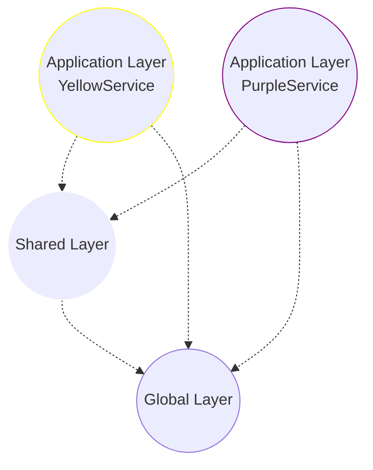
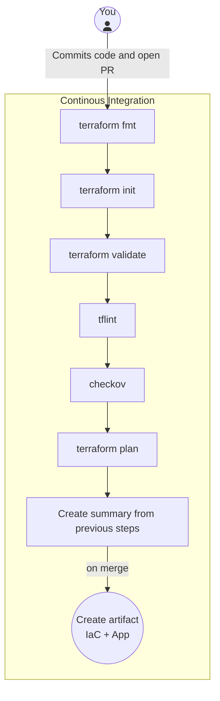
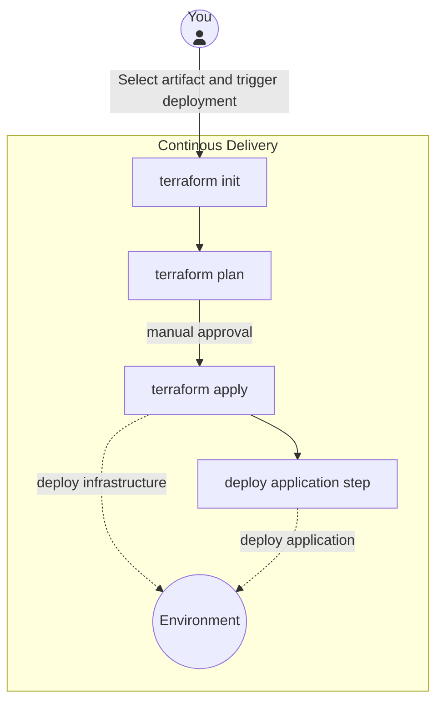
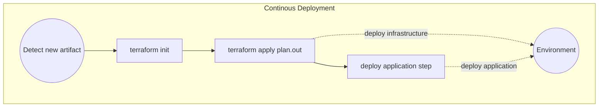

<style>
  img.mermaid {
    max-height: 500px; 
  }
</style>


# Introduction

I've been dealing with infrastructure as code for a few years now, and I've seen a lot of different ways people approach it, engaged in numerous discussions, and witnessed disasters caused by common pitfalls.

Personally, I treat my infrastructure code just like any other software code - from the planning stages all the way through to deployment. This approach has worked well for me and my team, but it's not easy. Our code, including infrastructure and testing code, reflects how we work and communicate on our projects. It's not just about the tools we use; it's about how we think about problems and solutions as a team.

# The Problem

Imagine this: you're a developer tasked with adding a new feature that requires changing a storage account setting. Seems simple enough, right? But here's the catch - all the infrastructure settings for the application are stored in the infrastructure repository managed by the "DevOps" team. So, you have to ask them to make the change, and now everyone, including developers, QA, and the product owner, has to wait.

Luckily, the "DevOps" team makes the change quickly and deploys it to the development environment. But now, the development environment is broken because the new configuration isn't matched with the right version of the service. It's nobody's fault - your colleague just did what you asked, but didn't know which version of the application should go with the infrastructure changes. After a frantic 20 minutes, you manage to deploy the right version of the application and fix broken environment.

Well, this happens... That's the purpose of development and testing environments: to break things safely. However, when it comes to production deployment, it's a different story. It's scheduled for Friday evening because the application sees minimal user activity on weekends, and the deployment process is complex. You need to coordinate all your teams and ensure that everyone is available to assist.

Even after successfully deploying the application to production, testing reveals failures. It takes two hours to discover that a related configuration change wasn't applied, and after figuring out which version of the infrastructure repository is related to the deployment, it's deployed. However, the feature still doesn't work as expected because a necessary storage account configuration is missing. A detail overlooked during infrastructure code review - it was added only to dev environment terraform files.

```
Infrastructure repository
├── dev
│   └── main.tf
└── prd
    └── main.tf

# looks familiar?
```

Trying to fix the issue, you realize that the provider version used in the production Terraform is different from the one in the development code, which doesn't support the required features for the storage account. Attempting to update the provider version leads to the output that it will delete and recreate the production database. After hours of firefighting and debugging, the deployment is postponed to the next Friday. To compound matters, you have to restore the previous database state from the backup because you already applied SQL migration scripts needed for the new application version.

It's not an optimistic story, but it's quite possible to encounter similar problems. Have you ever faced similar challenges? I certainly have.

## Breakdown

Let's break down the issues highlighted in the problem above:

- Dev and Ops separation
- Infrastructure separated from application
- Inconsistency between environments

The real issue here seems to be how the teams work together. The term "DevOps" is in quotes to show that the current way of working doesn't really follow DevOps principles - it's more like traditional waterfall with silos and hand-offs with some agile and DevOps badges glued to it. While there's nothing wrong with waterfall, it needs to be managed differently to work effectively.  However, it's a good thing that infrastructure is described as code. It's a step forward from manual configuration.

To move forward, it's important to see infrastructure as services rather than servers. Cloud infrastructure is essentially applications providing specific functions. So, treating infrastructure code with the same care as application code - using validation, rules, testing, and continuous integration and delivery or deployment, can help avoid past mistakes.

# Tools

I think sticking with just Terraform and a modern CI/CD platform is a solid approach. You can accomplish a lot without needing additional tools like Terragrunt and/or Terraform management platforms. It's best to keep things simple and only explore additional tools if you encounter specific problems that you can't solve with Terraform alone. Below approach has proven successful in numerous projects of various sizes where I've been responsible for the infrastructure.


**_NOTE:_** Although this article primarily focuses on Terraform and Azure, the tips and strategies discussed can be applied to any Infrastructure as Code language and cloud provider.

<div class="notice">{{ notice | markdownify }}</div>

# Code structure

Having a well-structured codebase makes developing your templates much easier. But how do you know if your code structure is "good"? Unfortunately, there aren't widely adopted patterns and principles for infrastructure as code, and everyone will tell you their way is the best - just like me!

You've probably heard of principles like KISS (Keep It Simple, Stupid), YAGNI (You Ain't Gonna Need It), and DRY (Don't Repeat Yourself). However, my advice is not to take them too seriously, especially when it comes to IaC. At the beginning, there will be a lot of duplication, and that's okay. It's fine to copy-paste some code until you understand which parts are the same across multiple places. Then you can refactor the code into reusable modules.

Trying to create perfect, reusable modules from day one will likely result in modules with many unused options that only get used in one place. Don't try to solve problems you don't have yet. If only one application is using a certain kind of resource, you probably don't need to wrap it in a module right away. Try not to overcomplicate things, even if it means some duplication.

## Environments

**Don't keep your environments in separate folders**. This approach will always cause problems, as mentioned in the introduction. Also, avoid keeping environments in branches unless you're using the same strategy for your application code. Instead, mirror your application development process - branching strategy, policies, environment promotions, etc.

Do you keep your application code for development and production in separate folders? If not, why would you do it with your infrastructure? Always **create a single version of your infrastructure for all environments and configure it with environment-specific variables**, just like you do with the application.

```bash
Terraform
├── parameters
│   ├── dev.tfvars
│   └── prd.tfvars
├── main.tf
├── terraform.tf
├── variables.tf
├── outputs.tf
└── providers.tf
```

Then deploy it from your CI/CD pipeline with the proper configuration, just like you deploy your application.

```powershell
az account set --subscription "blog-dev-sub-01"

terraform init --backend-config="dev.tfbackend" --backend-config="key=ServiceA.tfstate"
terraform apply --var-file="parameters/dev.tfvars"
```

In this setup, the backend definition is shared per environment. You only need to provide the state file name because each service has its own state.

```yaml
resource_group_name  = "blog-dev-rg-weu-state-01"
storage_account_name = "blogdevstweustate01"
container_name       = "tfstate"
use_azuread_auth     = true
```

Above solution doesn't require Terraform Workspaces or any additional tool. Just Azure CLI, and Terraform. You need to set the context to correct subscription before `terraform init` which makes things more secure. It's also super easy to automate all those steps in CI/CD process where you just need to provide correct environment and service name.

### Environment-specific configuration

It's best to have identical environments whenever possible. But in most cases, it's okay to use cheaper options (like lower storage redundancy) in non-production environments. After all, the risk of something going wrong there is lower. However, if your app relies on features only available in expensive plans, you'll need a way to test those features before deploying them to production.

Try to avoid any environment-specific logic, but if you really need it, then here's a tip for it: 
Instead of using environment names directly in your code (like `if environment == "prd"`), use "feature-flag" variables for each functionality. This makes your code more flexible and easier to understand.

Instead of:
```terraform
resource "azurerm_storage_account" "this" {  
  account_replication_type = var.environment == "prd" ? "GRS" : "LRS"
}
```

Use:
```terraform
resource "azurerm_storage_account" "this" {  
  account_replication_type = var.storage_account_replication_type
}
```

This approach makes your code cleaner and easier to manage. You can see the differences between environments by looking at their variable files. Plus, changing settings across environments is as simple as updating those variables.

For things that are the same in all environments, you can either set them as default variable values or hardcode them in your code if they shouldn't be changed.

## Modules

Once you have many places with duplicated code, it's a good time to create some modules. What works best for me is to create small modules that are responsible for one thing and avoid duplicating resource functionality in my modules - putting a single resource in a module in most cases doesn't make sense.

For example, here's an example of a small module called `cosmosdb`:

| Resource Name | Description |
|------|------|
| [azurecaf_name.this](https://registry.terraform.io/providers/aztfmod/azurecaf/latest/docs/resources/name) | To auto generate resource name that will fit our convention |
| [azurerm_cosmosdb_account.this](https://registry.terraform.io/providers/hashicorp/azurerm/latest/docs/resources/cosmosdb_account) | CosmosDB account that will hold databases |
| [azurerm_cosmosdb_gremlin_database.this](https://registry.terraform.io/providers/hashicorp/azurerm/latest/docs/resources/cosmosdb_gremlin_database) | Gremlin database that will hold graphs (created when variable `type` is set to `gremlin`) |
| [azurerm_cosmosdb_gremlin_graph.this](https://registry.terraform.io/providers/hashicorp/azurerm/latest/docs/resources/cosmosdb_gremlin_graph) | Gremlin graph |
| [azurerm_cosmosdb_sql_container.this](https://registry.terraform.io/providers/hashicorp/azurerm/latest/docs/resources/cosmosdb_sql_container) | NoSQL database that will hold containers (created when variable `type` is set to `nosql`) |
| [azurerm_cosmosdb_sql_database.this](https://registry.terraform.io/providers/hashicorp/azurerm/latest/docs/resources/cosmosdb_sql_database) | NoSQL container |
| [azurerm_cosmosdb_sql_role_assignment.data_contributor](https://registry.terraform.io/providers/hashicorp/azurerm/latest/docs/resources/cosmosdb_sql_role_assignment) | Data contributor role in CosmosDb RBAC (only for nosql) |
| [azurerm_cosmosdb_sql_role_assignment.data_reader](https://registry.terraform.io/providers/hashicorp/azurerm/latest/docs/resources/cosmosdb_sql_role_assignment) | Data reader role in CosmosDb RBAC (only for nosql) |
| [azurerm_role_assignment.data_reader](https://registry.terraform.io/providers/hashicorp/azurerm/latest/docs/resources/role_assignment) | Data reader role (only for gremlin) |

It includes everything needed to set up a CosmosDB in my project with ease! There is just NoSQL and Gremlin supported, because I don't use other APIs in my project which use this module.

Now, to create a fully working CosmosDB, I just need to call my module from the template:

```hcl
module "cosmosdb" {
  source = "git::https://github.com/krukowskid/terraform-modules-monorepo.git?ref=cosmosdb/v5.0.0"

  environment = {
    name   = var.environment
    number = var.env_number
  }
  project_name         = var.project_name
  caf_resources_suffix = var.resources_suffix

  resource_group = {
    location = azurerm_resource_group.this.location
    name     = azurerm_resource_group.this.name
  }
  type      = "NoSQL"
  free_tier = false

  data_contributor_role_assigment = merge(
    var.cosmosdb_data_contributor_role_assigment,
    {
      managed_identity = module.managed_identity.managed_identity_principal_id
    }
  )
  data_reader_role_assigment = var.cosmosdb_data_reader_role_assigment
  sql_databases              = ["database01", "database01"]
  sql_containers = [
    {
      name               = "container01"
      db_name            = "database01"
      partition_key_path = "/Pk"
    },
        {
      name               = "container02"
      db_name            = "database01"
      partition_key_path = "/Pk"
    },
    {
      name               = "container01"
      db_name            = "database02"
      partition_key_path = "/Pk"
    }
  ]
  tags = local.common_tags
}
```

Another example might be a Kubernetes cluster module, which requires a few separate resources to be configured.

What I often see are modules that either do too much, making them harder to reuse, or do too little like creating only SQL server without an option to create database, making them unnecessary compared to using resources directly.

### Storing and Versioning Modules

You can initially store modules in the same directory and reference them by path. However, for a better approach, use semantic versioning and ensure proper variable and output descriptions to facilitate easier reuse of your modules. If you're using GitHub Actions or Azure DevOps, I recommend trying out my solutions:

GitHub: [GitHub Powered Terraform Modules Monorepo](https://cloudchronicles.blog/blog/GitHub-Powered-Terraform-Modules-Monorepo/)

Azure DevOps: [Azure DevOps Terraform Modules Monorepo](https://cloudchronicles.blog/blog/Azure-DevOps-Terraform-Modules-Monorepo/)

or other Open-Source solutions like [Tapir](https://github.com/PacoVK/tapir)

For Bicep, you can host your modules in Azure Container Registry.

## Resource Naming

When it comes to naming resources in your Terraform code, clarity and consistency are key. By following some best practices, you can make your code more understandable and maintainable.

### Single resource of type

Avoid duplicating the type of the resource in the name. If there's only one instance of a resource in your code, name it simply `"this"`.

```
resource "azurerm_resource_group" "this" {
  # Configuration...
}
```

This simplifies referencing outputs from resources:

`azurerm_resource_group.this.name` versus `azurerm_resource_group.resource_group.name`
Which one is better?

### Multiple resources of type

If you need to create multiple resources of the same type in one template, use descriptive names without duplicating the type of the resource:
```
resource "azurerm_storage_account" "images" {
  # Configuration...
}
resource "azurerm_storage_account" "videos" {
  # Configuration...
}
```

## Versions

Always pin to exact versions for both modules and providers. For Terraform, specify versions like this `"= 3.1.5"` or simply `"3.1.5"`. This ensures that the same version is used consistently whenever you run your code. Use tags with semantic versioning if it's meant for humans, or commit SHA if you want to ensure that no one will change it. Use branches for testing only - to test the module or deploy changes from a branch to some sandbox environment before merging and tagging it. Additionally, commit your `.terraform.lock.hcl` file to your repository to ensure consistent behavior of `terraform apply`.

When it comes to versions of providers in modules, specify both the minimum and maximum versions of the provider. You can set a strict version in the module, but if you do, you'll need to update all modules at once to bump the provider version.

# Layers

I always break down my infrastructure into layers, which gives me more control and granularity over changes. Layers can reference higher layers but not the other way around. I typically start (and end up) with three layers - global, shared, and application and I mirror this approach in my IaC code. However, it's perfectly fine to begin with a single template to get things working initially and then split it into smaller templates, where each template has its own state file.

The downside of this approach is that you may need to deal with some dependencies between the layers.


*Source: [https://learn.microsoft.com/en-us/azure/architecture/guide/azure-resource-manager/advanced-templates/enterprise-infrastructure-bicep-container-registry](https://learn.microsoft.com/en-us/azure/architecture/guide/azure-resource-manager/advanced-templates/enterprise-infrastructure-bicep-container-registry)*

## Global Layer

In the global layer, you manage resources that are foundational and not expected to change frequently. These resources are typically shared across multiple applications and environments. Examples include DNS Zones, App Configuration, Container Registry or Application Insights with Log Analytics Workspace

- DNS Zones: Managing DNS configurations that are used across various applications
Container Registries: Storing Docker images that are shared across multiple services and environments.
- App Configurations: Configurations that are common to all applications, such as application settings or feature toggles.

By isolating these resources into a separate layer, you reduce the risk of accidentally modifying or deleting critical infrastructure components. Changes in this layer are typically infrequent and require careful consideration due to their impact on multiple services.

## Shared Layer

The shared layer contains resources that are shared across different applications but may vary based on the specific requirements of each application. These resources are typically scaled out to different regions and serve as foundational infrastructure components. Examples include common virtual networks, Kubernetes cluster, service bus queue, DNS Zone entries, shared compute instances or shared databases if multiple services use one.

The shared layer enables better resource utilization and promotes consistency across applications by centralizing commonly used resources. Changes in this layer should be carefully managed to ensure compatibility and consistency across all consuming applications.

## Application Layer

The application layer contains resources that are specific to the lifecycle of each application. These resources are tightly coupled with the application code and are typically deployed alongside the application. Examples include App Services, databases, Key Vault, Managed Identities

By organizing resources into the application layer, you simplify the management and deployment of application-specific infrastructure. Changes in this layer are closely tied to application changes and can be deployed together as part of a unified release process.

After introducing layers, your repositories should look like this:

```
# Infrastructure repository
├── Global
│   ├── parameters
│   │    ├── dev.tfvars
│   │    └── prd.tfvars
│   ├── main.tf
│   ├── terraform.tf
│   ├── variables.tf
│   ├── outputs.tf
│   └── providers.tf
└── Shared
    ├── parameters
    │    ├── dev.tfvars
    │    └── prd.tfvars
    ├── main.tf
    ├── terraform.tf
    ├── variables.tf
    ├── outputs.tf
    └── providers.tf
```

```
# Application "A" repository
├── terraform
│   ├── parameters
│   │    ├── dev.tfvars
│   │    └── prd.tfvars
│   ├── main.tf
│   ├── terraform.tf
│   ├── variables.tf
│   ├── outputs.tf
│   └── providers.tf
├── src
│    └── # application code ...
└── README.md
```

```
# Application "B" repository
├── terraform
│   ├── parameters
│   │    ├── dev.tfvars
│   │    └── prd.tfvars
│   ├── main.tf
│   ├── terraform.tf
│   ├── variables.tf
│   ├── outputs.tf
│   └── providers.tf
├── src
│    └── # application code ...
└── README.md
```

with monorepo:
```
# Monorepo
├── Infrastructure
│   ├── Global
│   │   ├── parameters
│   │   │   ├── dev.tfvars
│   │   │   └── prd.tfvars
│   │   ├── main.tf
│   │   ├── terraform.tf
│   │   ├── variables.tf
│   │   ├── outputs.tf
│   │   └── providers.tf
│   └── Shared
│       ├── parameters
│       │    ├── dev.tfvars
│       │    └── prd.tfvars
│       ├── main.tf
│       ├── terraform.tf
│       ├── variables.tf
│       ├── outputs.tf
│       └── providers.tf
│
├── ServiceA
│   ├── terraform
│   │   ├── parameters
│   │   │    ├── dev.tfvars
│   │   │    └── prd.tfvars
│   │   ├── main.tf
│   │   ├── terraform.tf
│   │   ├── variables.tf
│   │   ├── outputs.tf
│   │   └── providers.tf
│   └── src
│       └── # application code ...
│
├── ServiceB
│   ├── terraform
│   │   ├── parameters
│   │   │    ├── dev.tfvars
│   │   │    └── prd.tfvars
│   │   ├── main.tf
│   │   ├── terraform.tf
│   │   ├── variables.tf
│   │   ├── outputs.tf
│   │   └── providers.tf
│   └── src
│       └── # application code ...
│
└── README.md
```

## Dependencies Between Layers

Dependencies between layers are managed such that higher layers can reference resources from lower layers, but not vice versa. For example:

- The application layer can reference resources from both the shared layer (e.g. AKS clusters) and the global layer (e.g. DNS zones).
- The shared layer can only reference resources from the global layer.
- The global layer contains resources that are independent of other layers and are not dependent on resources from higher layers.



This hierarchical structure ensures that changes in lower layers do not impact resources in higher layers, promoting modularity and encapsulation. It also allows for better management of dependencies and reduces the risk of unintended consequences when making changes to infrastructure components. If you need to pass just a single value from one layer to another, you can simply pass it manually in variables, but if there are lots of references it would be better to use one of the following approaches:

### State and Deployment References

The simplest method in Terraform involves using remote state references, which are suitable for smaller environments. In Bicep, the equivalent approach is deployment reference. This serves as a solid starting point, allowing for progression to a more sophisticated solution as needed, especially when the current approach becomes restrictive.

However, there are challenges associated with referencing state files. These include compatibility issues between different versions of Terraform and the necessity for read access to the state file, which might contain sensitive information. In Bicep, deployments expire after a certain period, and references to them become invalid. Consequently, you may need to rerun the deployment just to refresh it and enable dependent layers to consume the outputs.

### Existing Resource Reference

A more complex yet robust solution involves referencing existing resources by tags. This method requires a well-defined tagging strategy but offers full independence from the outputs of other templates. The idea is to tag resources appropriately and then reference them based on these tags. For example, if you need to reference a cluster created in the shared layer from the application layer, you would use tags such as project, environment and location to identify the correct cluster. While this approach provides flexibility, it requires careful planning and collaboration to ensure consistent tagging across resources.

# Resources structure

## Subscriptions and Accounts

Consider creating a separate subscription or account per environment. This approach helps prevent costly mistakes and provides a clear separation of resources. In AWS, the same principle applies to accounts.

## Resource Groups

Typically, it's a good practice to have one resource group per layer of your infrastructure. However, there may be scenarios where you need additional resource groups due to technical requirements. For example, when creating Azure Kubernetes Service (AKS) clusters, you'll likely need a separate resource group for AKS-managed resources.

## Naming convention

Establishing a consistent naming convention for your resources is essential for clarity and organization. If your infrastructure is relatively static, aim for human-readable names that clearly describe the purpose of each resource. Additionally, consider incorporating tags to provide additional context and manageability.

If your infrastructure is more dynamic, such as when creating short-lived resources like temporary storage accounts, prioritize ensuring uniqueness over readability in your naming convention. However, regardless of the approach, strive for consistency to simplify management and maintenance tasks. Remember, infrastructure changes less frequently than application code, so investing in a clear naming convention upfront can save time and effort in the long run.

Here's an example naming convention:

```
<project>-<environment>-<region>-<resource-type>-<index>
```

- `<project>`: Name of the project.
- `<environment>`: Development (dev), Production (prd), etc.
- `<region>`: Region or location code (e.g. weu for West Europe).
- `<resource-type>`: Abbreviation or identifier for the resource type.
- `<index>`: Sequential index to differentiate resources of the same type within the same environment and project.

## Example Resource Structure

```
Azure tenant
├── Dev subscription
│   │ # Resources created by global layer terraform
│   ├── project-dev-weu-rg-global-01
│   │   ├── dev.example-domain.com (dns zone)
│   │   ├── project-dev-weu-appi-global-01 (application insights)
│   │   └── project-dev-weu-acr-global-01 (container registry)
│   │ 
│   │ # Resources created by shared layer terraform
│   ├── project-dev-weu-rg-shared-01
│   │   ├── project-dev-aks-weu-shared-01 (kubernetes services)
│   │   ├── project-dev-weu-vnet-global-01 (virtual network)
│   │   └── project-dev-msi-weu-shared-certmanager-01
│   ├── project-dev-weu-rg-shared-aks-01
│   │   └── (resources auto-managed by aks clsuter)
│   │ 
│   │ # Resources created by sns service Terraform (application layer)
│   ├── project-dev-weu-rg-sns-01
│   │   ├── projectdevweukvsns01
│   │   ├── project-dev-weu-msi-sns-01
│   │   ├── project-dev-weu-cosmos-sns-01
│   │   └── projectdevweustsns01
│   │ 
│   │ # Resources created by ntgs service Terraform (application layer)
│   └── project-dev-weu-rg-ntgs-01
│       ├── projectdevweukvntgs01
│       ├── project-dev-weu-msi-ntgs-01
│       └── project-dev-weu-sql-ntgs-01
│
└── Prd subscription
    │ # Resources created by global layer terraform
    ├── project-dev-weu-rg-global-01
    │   ├── example-domain.com (dns zone)
    │   ├── project-dev-weu-appi-global-01 (application insights)
    │   └── project-dev-weu-acr-global-01 (container registry)
    │ 
    │ # Resources created by shared layer terraform
    ├── project-dev-weu-rg-shared-01
    │   ├── project-dev-aks-weu-shared-01 (kubernetes services)
    │   ├── project-dev-weu-vnet-global-01 (virtual network)
    │   └── project-dev-msi-weu-shared-certmanager-01
    ├── project-dev-weu-rg-shared-aks-01
    │   └── (resources auto-managed by aks clsuter)
    │ 
    │ # Resources created by sns service Terraform (application layer)
    ├── project-dev-weu-rg-sns-01
    │   ├── projectdevweukvsns01
    │   ├── project-dev-weu-msi-sns-01
    │   ├── project-dev-weu-cosmos-sns-01
    │   └── projectdevweustsns01
    │ 
    │ # Resources created by ntgs service Terraform (application layer)
    └── project-dev-weu-rg-ntgs-01
        ├── projectdevweukvntgs-01
        ├── project-dev-weu-msi-ntgs-01
        └── project-dev-weu-sql-ntgs-01
```

## Tools for naming convention

While I've developed custom logic for Bicep to align with my naming conventions, for Terraform, I rely on the [azurecaf provider](https://registry.terraform.io/providers/aztfmod/azurecaf/latest/docs/resources/azurecaf_name). This provider ensures that my infrastructure remains consistent with the standards I've set.

# Deployments

Deploying infrastructure is a critical task, as even a small mistake could lead to significant consequences such as data loss or service disruptions. To mitigate these risks, it's essential to establish a repeatable and automated deployment process that minimizes the potential for human error. Achieving this level of reliability requires the tools and practices discussed in earlier steps, along with a CI/CD platform such as GitHub Actions. 

Ideally, the deployment workflow involves executing the `terraform apply` command just before deploying the application. However, this can be challenging due to the complexities involved in modifying or creating certain resources. In such cases, it may be necessary to create a separate deployment process specifically for infrastructure or implement a conditional step to deploy infrastructure only when needed.

In a continuous deployment scenario, running terraform plan before merging changes (e.g., on a pull request) may be sufficient. However, in continuous delivery workflows, where changes are deployed manually, it's crucial to generate a fresh plan immediately before deployment to ensure that the environment matches the expected state. Manual gates can be used to validate the plan and prevent unintended actions.

## Continuous Integration

CI is very important part of IaC, yet it's often overlooked. Its primary objective is straightforward: to identify and address any issues or misconfigurations in the codebase as early as possible, ideally before merging changes.

In my CI process, I rely on the following free and open-source tools and commands:

- **Checkov**: A tool for statically analyzing IaC files to detect security and compliance issues.
- **TFlint**: A Terraform linter that checks for errors, best practices, and potential issues in Terraform configuration files.
- **Terraform fmt**: This command ensures that Terraform configuration files adhere to a consistent format, making them easier to read and maintain.
- **Terraform validate**: It checks the syntax and structure of Terraform configuration files, ensuring they are valid and can be processed by Terraform.
- **Terraform plan**: Generates an execution plan for changes to the infrastructure, allowing us to review the proposed modifications before applying them.

By integrating these tools into the CI pipeline, we can establish a solid CI process that detects and addresses potential issues early on. The diagram below illustrates the typical flow of this CI process:



## Continuous Delivery

Once your changes have been merged and an artifact has been created, you are prepared for deployment. Because both your infrastructure and application files are stored together, generating a single artifact is straightforward. The next step involves selecting the appropriate artifact containing both the infrastructure and the built application and applying it to the desired environment.



## Continuous Deployment

Continuous deployment operates differently, as each merge triggers a deployment process. Implementing this requires a high level of maturity from team members and involves crafting a robust process. However, the effort invested is worthwhile. In addition to advancing the process, it's crucial to have a plan in place for rollback and recovery in case of issues.

With continuous deployment, it's essential to ensure the changes are thoroughly reviewed before merging them. This includes reviewing any infrastructure changes alongside application changes. While smaller teams may opt to simply apply changes, it's recommended to reference the Terraform plan output from the last continuous integration (CI) run before the merge. This helps avoid discrepancies between the merge and deployment, which can occur during the 5 to 60 minutes between these stages, depending on the environment and the number of tests. However, if your team follows a policy where branches must be up-to-date with the main branch before merging, you're less likely to run into problems even without using plan from PR, as long as there aren't any manual changes made to the environment.




This may look a bit scary, in my project, we've successfully employed Continuous Deployment for both infrastructure and application code using the practices outlined in this article. After over 5000 deployments, we've encountered no serious issues. 

# Conclusion

By following these principles and best practices, you can effectively manage your cloud infrastructure using IaC and ensure a more efficient, reliable, and secure development process.

[https://learn.microsoft.com/en-us/azure/architecture/guide/azure-resource-manager/advanced-templates/enterprise-infrastructure-bicep-container-registry](https://learn.microsoft.com/en-us/azure/architecture/guide/azure-resource-manager/advanced-templates/enterprise-infrastructure-bicep-container-registry)

[https://learn.microsoft.com/en-us/azure/well-architected/operational-excellence/infrastructure-as-code-design](https://learn.microsoft.com/en-us/azure/well-architected/operational-excellence/infrastructure-as-code-design)